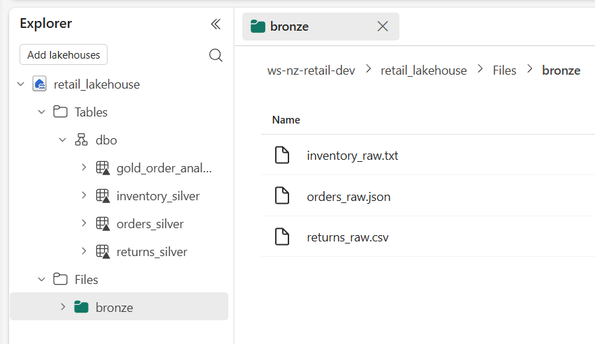
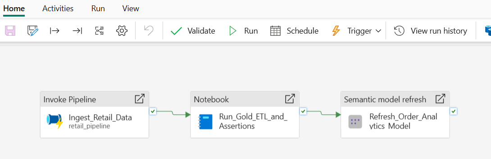

# End-to-End Retail Data Pipeline & Analytics in Microsoft Fabric

## Overview

This repository contains the full source code, data transformations, and orchestration workflows for an automated retail data pipeline built inside **Microsoft Fabric** (`ws-nz-retail-dev`).

The system ingests raw multi-format transaction logs (JSON, CSV, and Pipe-delimited TXT) from external HTTP endpoints, processes them using a Medallion Architecture (Bronze $\rightarrow$ Silver $\rightarrow$ Gold) via PySpark, executes embedded data quality assertions, updates semantic reporting models, and orchestrates daily batch runs.

---

## Lakehouse & Storage Architecture



### Storage Structure (`retail_lakehouse`)

- **Files / `Files/bronze/`**: Raw landed source files downloaded via HTTP ingestion:
  - `orders_raw.json` — Transactional orders log (JSON format)
  - `returns_raw.csv` — Order returns and refund logs (CSV format)
  - `inventory_raw.txt` — Stock availability and unit cost records (Pipe-delimited `|` text format)
- **Tables / `dbo/`**: Delta Lake tables created and updated during pipeline execution:
  - `orders_silver` — Cleaned order records with typed attributes and formatted timestamps
  - `returns_silver` — Sanitized returns dataset
  - `inventory_silver` — Standardized product stock and cost references
  - `gold_order_analytics` — Curated analytical table with profit calculations and financial assertions

---

## Technical Pipeline Execution

### Step 1: HTTP Ingestion (`retail_pipeline`)

- **Source:** GitHub raw files via public HTTP endpoints.
- **Mechanism:** A Data Factory child pipeline (`retail_pipeline`) uses a `ForEach` activity to iterate over file metadata.
- **Target:** Downloads incoming source payloads directly into `Files/bronze/` inside `retail_lakehouse`.

---

### Step 2: Medallion Processing & Data Quality (`nb_medallion_processing`)

#### 1. Bronze Load & Implicit Schema Inference

PySpark reads raw files directly from OneLake file paths:

- `spark.read.json("Files/bronze/orders_raw.json")`
- `spark.read.option("header", "true").csv("Files/bronze/returns_raw.csv")`
- `spark.read.option("header", "true").option("delimiter", "|").csv("Files/bronze/inventory_raw.txt")`

#### 2. Silver Transformations & Delta Table Writes

Standardizes schema types, strips currency symbols (`$`), trims whitespace, normalizes string casing, and writes managed Delta tables using `mode("overwrite")`:

- **`orders_silver`**: Casts `Order_ID` and `cust_id` to `long`, `Qty` to `integer`, extracts `Order_Amount$` to double (`Order_Amount`), maps status variants (`"delivrd"` $\rightarrow$ `"delivered"`), and standardizes `Order_Date` (`yyyy-MM-dd`).
- **`returns_silver`**: Casts `Return_ID` / `Order_ID` to `long`, `Return_Amount` to `double`, and formats `Return_Date`.
- **`inventory_silver`**: Casts `Stock_Available` to `integer` and `Unit_Cost_USD` to `double`.

#### 3. Gold Aggregations & Programmatic Assertions

Joins Silver tables to derive financial metrics and executes inline data quality checks prior to writing `gold_order_analytics`:

- **Derived Calculations:**
  Net_Revenue = coalesce(Order_Amount, 0.0) - coalesce(Return_Amount, 0.0)
  Total_Cost = Qty \* coalesce(Unit_Cost_USD, 0.0)
  Profit = Net_Revenue - Total_Cost
- **Quality Checks:** Runs explicit PySpark `assert` statements validating expected row counts, primary key integrity (`Order_ID IS NOT NULL`), missing financial values, and profit math consistency.

### Power BI Executive Dashboard


### Step 4: Executive Reporting & Visual Analytics(`Executive_Order_Analytics_Dashboard`)

- **Semantic Model Integration:** Connects directly to `Order_Analytics_Model` built on top of `gold_order_analytics` in Direct Lake / Import mode for real-time performance tracking.
- **Key Visual Performance Indicators:**
  - **Financial Summary Cards:** Displays real-time aggregated metrics for **Gross Net Revenue**, **Gross Total Cost**, **Gross Profit**, and **Profit Margin %**.
  - **Product Profitability Rankings:** Visualizes top and bottom performing retail products to identify core revenue drivers and margin leaks.
  - **Sales & Volume Trends:** Breaks down transactional volume (`Qty`) across order statuses (`delivered`, `cancelled`, `processing`).
  - **Returns Analysis:** Monitors return metrics (`Return_Amount`) against gross sales to highlight product return rates.

---

## Pipeline Orchestration

### Master Daily Orchestration (`pl_master_daily_orchestrator`)



1. **Invoke Pipeline (`Ingest_Retail_Data`)**: Triggers `retail_pipeline` to pull fresh raw files from HTTP endpoints into `Files/bronze/`.
2. **Notebook Activity (`Run_Gold_ETL_and_Assertions`)**: Upon ingestion completion, executes `nb_medallion_processing` to run cleaning, Silver writes, Gold calculations, and quality assertions.
3. **Semantic Model Refresh (`Refresh_Order_Analytics Model`)**: Upon notebook success, triggers an automated refresh of `Order_Analytics_Model` to update downstream visuals in `Executive_Order_Analytics_Dashboard`.

---

## Repository Contents

```text
ws-nz-retail-dev/
├── notebooks/
│   └── nb_medallion_processing.py       # PySpark Medallion ETL & assertion script
├── dashboards/
│   └── Executive_Order_Analytics_Dashboard.pbix # Power BI report file
├── screenshots/
│   ├── lakehouse_files_structure.png    # OneLake directory & Delta table screenshot
│   └── orchestration_pipeline.png       # Orchestration pipeline run screenshot
└── README.md                            # Documentation
```
